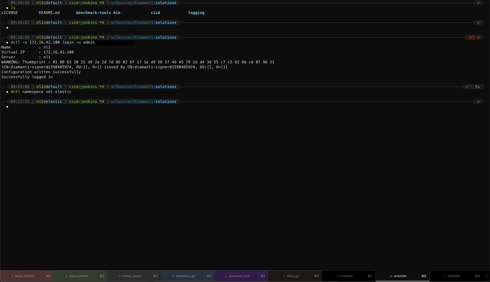

# dotfiles



The prompt structure is as follows: ***time | kubernetes-cluster-name@current-namespace | git status | directory***

This is all ZSH based so you need it as your primary shell:

```bash
brew install zsh
chsh -s /usr/local/bin/zsh
```

#### NOTE: OS X Big Sir and later come with ZSH built-in, but I prefer using the latest from brew as its part of my new machine workflow anyway

The prompt itself is based on powerlevel10k & z4h <https://github.com/romkatv/powerlevel10k> & <https://github.com/romkatv/zsh4humans>
z4h includes a copy of powerlevel10k so you dont need to install both.

```bash
if command -v curl >/dev/null 2>&1; then
  sh -c "$(curl -fsSL https://raw.githubusercontent.com/romkatv/zsh4humans/v5/install)"
else
  sh -c "$(wget -O- https://raw.githubusercontent.com/romkatv/zsh4humans/v5/install)"
fi
```

#### NOTE: I provide my own `p10k.zsh` which customizes the theme to my liking, but if you would like to see what the theme author meant for things to look and behave like feel free to run `p10k configurator` and generate your own `p10k.zsh` file.

I use a few other tools to make shell life easier so go ahead and install those as well:

```bash
brew install bat tig lsd mackup tmux tmuxinator xpanes k9s font-meslo-for-powerline
brew cask install iterm2 atext copyq
```

***aText*** https://trankynam.com/atext/ is a licensed app, it costs $5, but it is going to be the best $$ you have ever spent. Once you start it up, simply go into the snippets folder, select all on the files and open them with aText to import text insertion snippets. Check the [snippets README](snippets/README.md) for description of what subsitutions are available.

***copyQ*** https://hluk.github.io/CopyQ/ is a free clipboard history, make a global shortcut of CTL+Shift+V and have it pop up a searchable paste history over the last million or so paste items you have had :)

***iterm2*** https://iterm2.com/ best terminal... not much more to say

***Mackup*** https://github.com/lra/mackup lets me sync ALL my configs straight to cloud and pull down automatically on any new machine, so I dont have to muck about with dotfile repositroies as it also does regular OS X application configs

Copy the `zshrc.custom`, `p10k.zsh`, `tmuxinator/` and `nanorc` files to your `$HOME/.`

Finally add a line to load `zshrc.custom` from the main `zshrc` file: `echo z4h source ~/.zshrc.custom >> .zshrc`

You can now start a new iTerm session. I use its TMUX integration combined with Tmuxinator so to attach back or re-create my sessions in tmux simply do. You can edit the file and build your own window flow:

```bash
tmuxinator start default
```

I have placed `##MODIFY##` in all the dotfiles in places I generally think people will want their own modifications.
